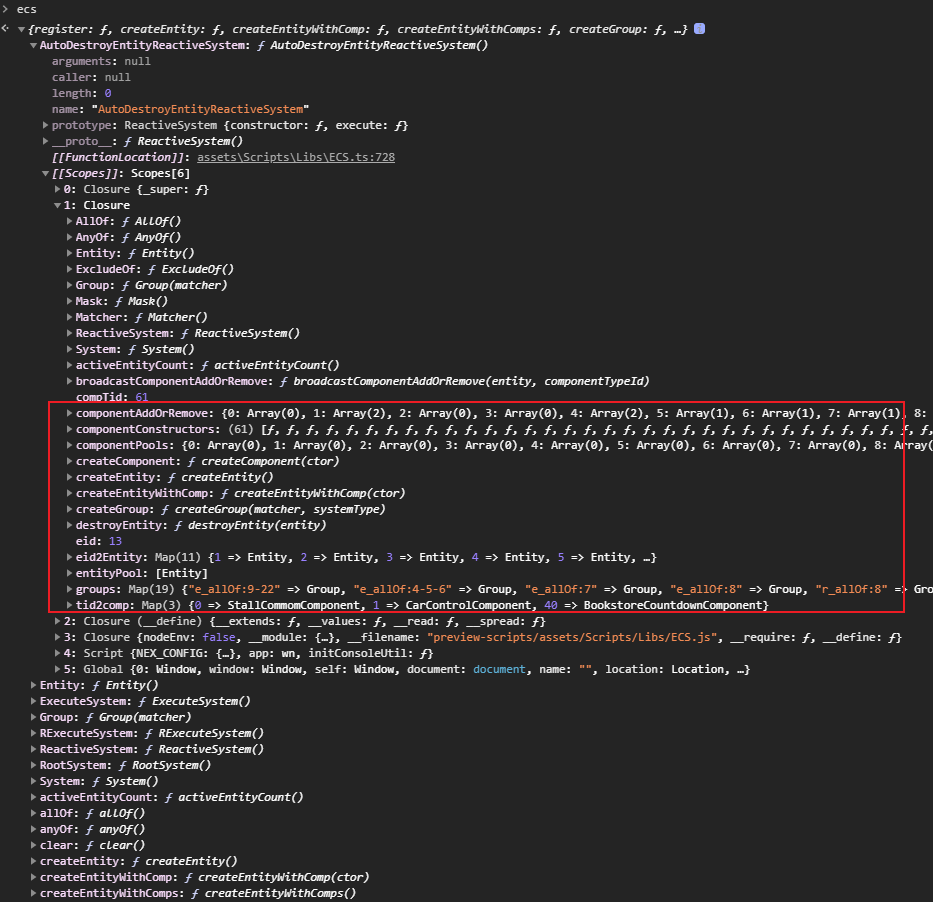

# 简介
这是一个Typescript语言版的Entity-Component-System框架。框架参考了Unity的[Entitas](https://github.com/sschmid/Entitas-CSharp)框架。

# 使用说明
## 组件
自定义组件必须继承ecs.IComponent，并且需要使用ecs.register注册组件。
```TypeScript
@ecs.register('Hello')
export class HelloComponent extends ecs.IComponent {
    info: string;
    data: number;

    // 组件被回收前会调用这个方法。
    reset() {
        this.info = '';
        this.data = 0;
    }
}
```

tag类组件
```Typescript
@ecs.registerTag()
export class ECSTag {
    static Tag1: number;
    static Tag2: number;
    static tag3: number;
}

// 相关使用方法
ecs.createEntityWithComps(Comp1, ECSTag.Tag1)

ent.hasTag(ECSTag.Tag1)

ent.addTag(ECSTag.Tag2)

ent.removeTag(ECSTag.Tag2)
```

“能力”类组件
```Typescript
@ecs.register('Test1Component')
export class Test1Component extends ecs.IComponent {
    data1: number = 1;
    reset() {

    }
}

@ecs.register('Test2Component')
export class Test2Component extends ecs.IComponent {
    data2: number = 1;
    reset() {

    }
}

@ecs.register('AbilityComponent')
export class AbilityComponent extends ecs.IComponent  {
    static matcher: ecs.IMatcher = ecs.allOf(Test1Component, Test2Component);

    cal() {
        let t1Comp = this.ent.get(Test1Component);
        let t2Comp = this.ent.get(Test2Component);
        return t1Comp.data1 + t2Comp.data2;
    }
}

let ent = ecs.createEntity();
ent.add(Test1Component);
ent.add(Test2Component); // 当实体身上的组件组合满足AbilityComponent的matcher时ecs系统会自动给实体添加AbilityComponent组件

ent.remove(Test2Component); // 当实体身上的组件组合不满足时ecs系统会自动从实体身上移除AbilityComponent组件
```


## ecs.register功能
- 能通过```entity.Hello```获得组件对象；
- 将组件的构造函数存入ecs上下文中，并且给该类组件分配一个组件id。

## 实体
为了能利用Typescript的类型提示机制，在使用实体的时候需要用户自己继承ecs.Entity。
```TypeScript
export class HelloEntity extends ecs.Entity {
    Hello: HelloComponent; // 这里的Hello要和ecs.register中填入的参数一致
}
```

添加组件：
```TypeScript
entity.add(HelloComponent); // 添加组件时会优先从组件缓存池中获取无用的组件对象，如果没有才会新创建一个组件对象
```

删除组件：
```TypeScript
entity.remove(HelloComponent); // 组件对象会从实体身上移除并放入组件缓存池中
```

获得组件对象：
```TypeScript
1、entity.Hello; // 见上方自定义实体操作

2、entity.get(HelloComponent);
```

判断是否拥有组件：
```TypeScript
1、entity.has(HelloComponent);

2、!!entity.Hello;
```

销毁实体：
```TypeScript
entity.destroy() // 销毁实体时会先删除实体身上的所有组件，然后将实体放入实体缓存池中
```

## 实体筛选
目前提供了四种类型的筛选能力，但是这四种筛选能力可以组合从而提供更强大的筛选功能。
- anyOf: 用来描述包含任意一个这些组件的实体；
- allOf: 用来描述同时包含了这些组件的实体；
- onlyOf: 用来描述只包含了这些组件的实体；不是特殊情况不建议使用onlyOf，因为onlyOf会监听所有组件的添加和删除事件；
- excludeOf: 表示不包含所有这里面的组件（“与”关系）；

使用方式：

- 表示同时拥有多个组件
```TypeScript
ecs.allOf(AComponent, BComponent, CComponent);
```
- 表示拥有任意一个组件
```Typescript
ecs.anyOf(AComponent, BComponent);
```
- 表示拥有某些组件，并且不包含某些组件
```Typescript
// 不包含CComponent或者DComponent
ecs.allOf(AComponent, BComponent).excludeOf(CComponent, DComponent);

// 不同时包含CComponent和DComponent
ecs.allOf(AComponent, BComponent).excludeOf(CComponent).excludeOf(DComponent);
```

### 直接查询并获得实体
```Typescript
ecs.query(ecs.allOf(Comp1, Comp2))
```

## 系统
- ecs.System: 用来组合某一功能所包含的System；
- ecs.RootSystem: System的root；
- ecs.ComblockSystem: 抽象类，组合式的System。默认情况，如果该System有实体，则每帧都会执行update方法；
- ecs.IEntityEnterSystem: 实现这个接口表示关注实体的首次进入；
- ecs.IEntityRemoveSystem: 实现这个接口表示关注实体的移除；
- ecs.ISystemFirstUpdate: 实现这个接口会在System第一次执行update前执行一次firstUpdate

# 怎么使用
1、声明组件
```TypeScript
@ecs.register('Node')
export class NodeComponent extends ecs.IComponent {
    val: cc.Node = null;

    reset() {
        this.val = null;
    }
}

@ecs.reigster('Move')
export class MoveComponent extends ecs.IComponent {
    heading: cc.Vec2 = cc.v2();
    speed: number = 0;

    reset() {
        this.heading.x = 0;
        this.heading.y = 0;
        this.speed = 0;
    }
}

@ecs.register('Transform')
export class TransformComponent extends ecs.IComponent {
    position: cc.Vec2 = cc.v2();
    angle: number;
    reset() {
    
    }
}

export class AvatarEntity extends ecs.Entity {
    Node: NodeComponent;
    Move: MoveComponent;
    Transform: TransformComponent;
}
```

2、创建系统
```TypeScript
export class RoomSystem extends ecs.RootSystem {
    constructor() {
        super();
        this.add(new MoveSystem());
        this.add(new RenderSystem());
    }
}

export class MoveSystem extends ecs.ComblockSystem<AvatarEntity> implements ecs.IEntityEnterSystem {

    init() {
    
    }

    filter(): ecs.Matcher {
        return ecs.allOf(MoveComponent, TransformComponent);
    }

     // 实体第一次进入MoveSystem会进入此方法
    entityEnter(entities: AvatarEntity[]) {
        for(e of entities) {
            e.Move.speed = 100;
        }
    }
    
    // 每帧都会更新
    update(entities: AvatarEntity[]) {
        for(let e of entities) {
            let moveComp = e.Move; // e.get(MoveComponent);
            lel position = e.Transform.position;
            
            position.x += moveComp.heading.x * moveComp.speed * this.dt;
            position.y += moveComp.heading.y * moveComp.speed * this.dt;
            
            e.Transform.angle = cc.misc.lerp(e.Transform.angle, Math.atan2(moveComp.speed.y, moveComp.speed.x) * cc.macro.DEG, dt);
        }
    }
}

export class RenderSystem extends.ecs.ComblockSystem<AvatarEntity> implements ecs.IEntityEnterSystem, ecs.IEntityRemoveSystem {
    filter(): ecs.Matcher {
        return ecs.allOf(NodeComponent, TransformComponent);
    }
    
    // 实体第一次进入MoveSystem会进入此方法
    entityEnter(entities: AvatarEntity[]) {
        for(e of entities) {
            e.Node.val.active = true;
        }
    }
    
    entityRemove(entities: AvatarEntity[]) {
        for(let e of entities) {
            // Global.avatarNodePool.put(e.Node.val);
        }
    }
    
    update(entities: AvatarEntity[]) {
        for(let e of entities) {
            e.Node.val.setPosition(e.Transform.position);
            e.Node.val.angle = e.Transform.angle;
        }
    }
}
```

3、驱动ecs框架
```TypeScript
const { ccclass, property } = cc._decorator;
@ccclass
export class GameControllerBehaviour extends cc.Component {
    rootSystem: RootSystem = null;

    onLoad() {
        this.rootSystem = new RootSystem();
        this.rootSystem.init();
    }
    
    createAvatar(node: cc.Node) {
        let entity = ecs.createEntityWithComps<AvatarEntity>(NodeComponent, TransformComponent, MoveComponent);
        entity.Node.val = node;
        // entity.Move.speed = 100;
    }

    update(dt: number) {
        this.rootSystem.execute(dt);
    }
}

```

# 调试
添加如下代码
```TypeScript
windows['ecs'] = ecs;
```
在chrome浏览器的console中输入ecs可看到


其中红框内为ecs上下文数据。

# 相关ecs框架
https://github.com/dualface/ecs-typescript

https://github.com/nomos/lokas-ts

https://github.com/darkoverlordofdata/entitas-ts

https://github.com/NateTheGreatt/bitecs

https://github.com/ecsyjs/ecsy

https://github.com/dannyfritz/flock-ecs

https://github.com/ddmills/geotic

https://github.com/fireveined/perform-ecs

https://github.com/ayebear/picoes

https://github.com/bvalosek/tiny-ecs
